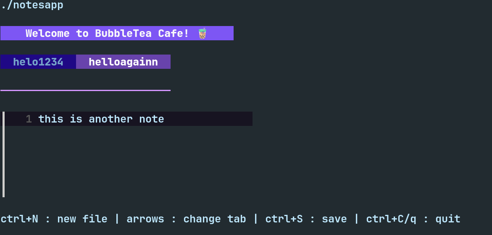

# 🧋 BubbleTea Cafe : A notes app written in Go

A notes app implemented with components from the charm library like bubbletea, bubbles and lipgloss for a very basic UI

Has functionalities of creating a directory in your system for all your notes to be saved, adding multiple notes at once (using tabs) and saving your files to your notes directory

To run it on your local device, clone the repository, then run:
```
go mod tidy   //to install all packages
make run
```
and your notesapp will show up in your terminal, no external dependencies required!

